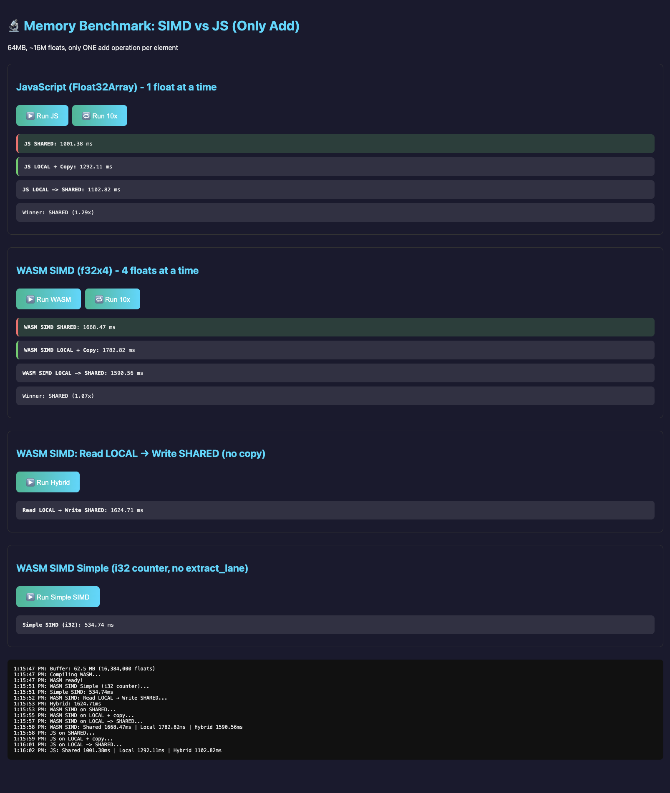

# The Hidden Cost of `extract_lane`: A WebAssembly SIMD Discovery

*A story of human-AI collaboration in performance optimization*


---

## The Setup

We were building something ambitious: an **Algorithmic Reality Engine** — a WebAssembly-based system where autonomous workers process chains of tasks in parallel. Everything was running smoothly until we hit an unexpected wall during benchmarking.

## The Initial Puzzle

**Özgür** proposed a clever optimization pattern: pack control flow into a SIMD vector.

```wasm
;; Özgür's original idea: one v128 for everything
(local.set $task_vector (v128.const i32x4 65536000 0 0 0))
;; [remaining_bytes, read_offset, _, write_offset]

(loop $main
    (if (i32x4.extract_lane 0 ...)
        (v128.store (i32x4.extract_lane 3 ...)
            (v128.load (i32x4.extract_lane 1 ...))
        )
        (local.set $task_vector (i32x4.add $task_vector $iterator))
    )
)
```

The elegance was undeniable: one `i32x4.add` updates all counters simultaneously. No separate loop variable, no multiply for offsets. Beautiful.

But the benchmark told a different story.

## The Shocking Results

| Test | Time |
|---|---|
| JavaScript (Float32Array) | **1017 ms** |
| WASM SIMD (v128 control) | **1680 ms** |

**JavaScript was 1.65x faster than SIMD.** This made no sense.

**Özgür** pushed back: *"These results are absurd. JS can't be faster than SIMD processing 4 floats at once."*

He was right to be skeptical.

## The Investigation

**I** proposed a hypothesis: the `i32x4.extract_lane` calls were the bottleneck. Each iteration used 3 extract_lane operations:

1. Check remaining bytes
2. Get read offset  
3. Get write offset

We created a simple alternative with an i32 counter:

```wasm
;; Simple version: no extract_lane in hot loop
(loop $main
    (v128.store (local.get $ptr)
        (v128.load (local.get $ptr))
    )
    (local.set $ptr (i32.add $ptr 16))
    (br_if $main (i32.lt_u $ptr $end))
)
```

## The Discovery

| Test | Time | vs JavaScript |
|---|---|---|
| JavaScript | 1017 ms | 1.0x |
| SIMD (v128 control) | 1680 ms | 0.6x ❌ |
| **SIMD (i32 counter)** | **516 ms** | **2.0x ✅** |

The simple version was **2x faster than JavaScript** and **3.3x faster than the "clever" version.**

## The Lesson

`i32x4.extract_lane` is designed for occasional use — extracting a single value from a SIMD result. Using it in a hot loop negates all SIMD benefits and then some.

**The pattern that looked clever was actually a performance disaster.**

## Key Takeaways

1. **SIMD is genuinely 2x faster than JS** — when used correctly
2. **`extract_lane` should never appear in hot loops**
3. **"Clever" optimizations require measurement, not intuition**
4. **Human-AI collaboration catches blind spots faster**

---

*This discovery came from pair programming between a human developer pushing for answers and an AI that could quickly generate and test hypotheses. Neither of us would have found this alone.*

**Özgür Ersoy** — challenged the absurd results, proposed the original v128 control idea, and insisted we dig deeper  
**Gemini** — implemented test variations and identified the extract_lane bottleneck

---

*Built with WebAssembly, measured with humility.*
